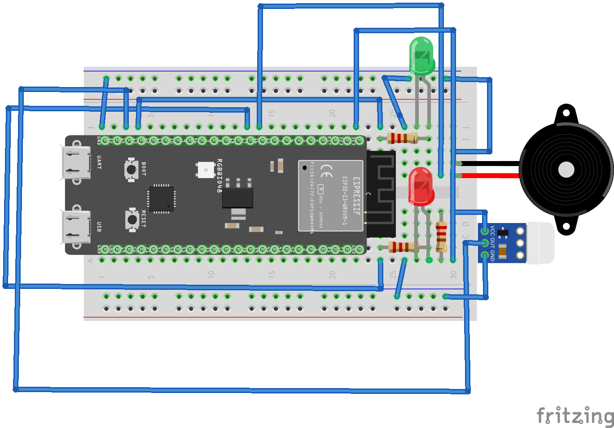

# Smart-Home-Security-System-ESP

Умная система безопасности для дома на базе ESP32-S3-N8R2 с датчиком движения, звуковой сигнализацией и веб - интерфейсом.



## Особенности

- **Веб-интерфейс для управления с любого устройства**
- **PIN-авторизация - доступ по коду (пользовательский и мастер-пароль)**
- **Визуальная индексация с помощью светодиодов (красный, зелёный)**

## Компоненты

- **ESP32-S3-N8R2**
- **Датчик движения AM312 (PIR)**
- **Пьезоизлучатель**
- **Светодиоды (красный, зелёный)**
- **Резисторы 220 Ом**

## Быстрый старт

### 1. Установка библиотек

Установите через Arduino Library Manager:
- **PsychicHttp** by hoeken
- **WiFi** (встроенная)

### 2. Настройка Wi-Fi

В коде замените на свои данные Wi-Fi
```cpp
const char* ap_ssid = "WIFI";           // Имя вашей сети
const char* ap_password = "PasswordWIFI"; // Пароль
```

### 3. Настройка PIN-кодов

В коде установите свои PIN-коды
```cpp
String userPin = "1234";              // Пользовательский PIN (можно менять)
const String masterPin = "admin123";  // Мастер-пароль (зашит в прошивке)
```

### 4. Загрузка кода
- Подключите ESP32 через USB
- Выберите плату: ESP32 Dev Module
- Установите библиотеку PsychicHttp
- Загрузите код
- Откройте монитор порта для получения IP-адреса
- Подключитесь к той же Wi-Fi сети и откройте IP в браузере

## Использование
### Включение системы:
- Подключите ESP32 к USB
- Система издаёт двойной звуковой сигнал при подключении к Wi-Fi
- IP-адрес отображается в мониторе порта

### Управление охраной через веб-интерфейс:
- Кнопка "Arm Security" - постановка на охрану
- Кнопка "Disarm" - снятие с охраны (требуется PIN)
- Зелёный LED - система на охране
- Красный LED - тревога или снята с охраны

### При срабатывании:
- Датчик движения обнаруживает активность
- Загорается красный LED
- Начинается обратный отсчёт 10 секунд в веб-интерфейсе
- У вас есть 10 секунд чтобы ввести PIN-код
- При правильном PIN - тревога снимается
- При неправильном PIN или истечении времени - включается сирена

### Смена PIN-кода:
- Убедитесь, что охрана выключена (DISARMED)
- Введите мастер-пароль (по умолчанию: admin123)
- Введите новый пользовательский PIN
- Нажмите "Change User PIN"

### Особенности безопасности
- Смена PIN запрещена при включённой охране
- Мастер-пароль зашит в прошивке и не может быть изменён через веб
- Сирена автоматически отключается через 1 час
- Звуковое подтверждение всех действий

## Устранение неполадок
### ESP32 не подключается к Wi-Fi:
- Проверьте правильность SSID и пароля
- Убедитесь, что сеть работает на частоте 2.4 ГГц
- Перезагрузите роутер и ESP32

### Не работает датчик движения:
- Дайте AM312 1 минуту на калибровку после включения
- Проверьте питание (3.3V)
- Убедитесь, что датчик не направлен на источники тепла

### Не открывается веб-страница:
- Проверьте IP-адрес в мониторе порта
- Убедитесь, что устройство в той же Wi-Fi сети
- Отключите VPN и прокси

# Smart-Home-Security-System-ESP

A smart home security system based on ESP32-S3-N8R2 with motion detection, sound alarm, and web interface.


## Features

- **Web interface for control from any device**
- **PIN authorization - code-based access (user and master PIN)**
- **Visual status indication using LEDs (red, green)**

## Components

- **ESP32-S3-N8R2**
- **AM312 Motion Sensor (PIR)**
- **Piezo Buzzer**
- **LEDs (red, green)**
- **220 Ohm Resistors**

## Quick Start

### 1. Install Libraries

Install via Arduino Library Manager:
- **PsychicHttp** by hoeken
- **WiFi** (built-in)

### 2. Configure Wi-Fi

Replace with your Wi-Fi credentials in the code:
```cpp
const char* ap_ssid = "WIFI";              // Your network name
const char* ap_password = "PasswordWIFI";  // Your password
```

### 3. Configure PIN Codes

Set your PIN codes in the code:
```cpp
String userPin = "1234";              // User PIN (changeable)
const String masterPin = "admin123";  // Master PIN (hardcoded in firmware)
```

### 4. Upload Code
- Connect ESP32 via USB
- Select board: ESP32 Dev Module
- Install PsychicHttp library
- Upload the code
- Open Serial Monitor to get IP address
- Connect to the same Wi-Fi network and open the IP in your browser

## Usage
### Power On:
- Connect ESP32 to USB
- System plays a double beep when connected to Wi-Fi
- IP address is displayed in Serial Monitor

### Security Control via Web Interface:
- "Arm Security" button - arm the system
- "Disarm" button - disarm the system (PIN required)
- Green LED - system is armed
- Red LED - alarm triggered or system disarmed

### When Motion is Detected:
- Motion sensor detects activity
- Red LED turns on
- 10-second countdown begins in the web interface
- You have 10 seconds to enter the PIN code
- With correct PIN - alarm is canceled
- With wrong PIN or timeout - siren activates

### Changing PIN Code:
- Ensure the system is DISARMED
- Enter Master PIN (default: admin123)
- Enter new user PIN
- Click "Change User PIN"

### Security Features
- PIN change is prohibited when system is ARMED
- Master PIN is hardcoded in firmware and cannot be changed via web
- Siren automatically turns off after 1 hour
- Audio confirmation for all actions

## Troubleshooting
### ESP32 won't connect to Wi-Fi:
- Check SSID and password for typos
- Make sure network operates on 2.4 GHz frequency
- Restart router and ESP32

### Motion sensor not working:
- Allow AM312 1 minute to calibrate after power on
- Check power supply (3.3V)
- Ensure sensor is not pointed at heat sources

### Web page not loading:
- Verify IP address in Serial Monitor
- Make sure device is on the same Wi-Fi network
- Disable VPN and proxy
